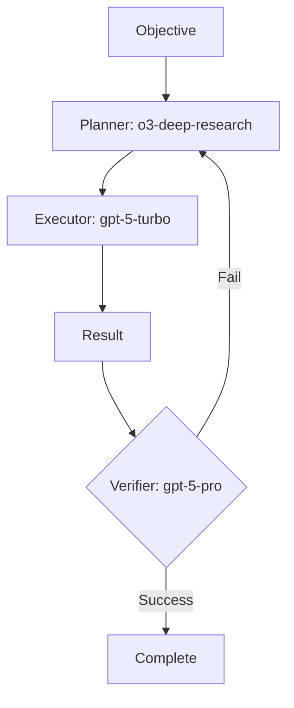

# AI-PRO Reference: The GPT-5 Era & Autonomous Agents

## Overview
As of January 2026, the AI landscape has shifted from chat-based assistants to **Autonomous Agentic Systems**. This reference covers the integration and orchestration of the GPT-5 family and the specialized `o3-deep-research` models.

## The GPT-5 Model Family
GPT-5 represents a leap in reasoning and multi-modal understanding.

### Key Capabilities:
- **Zero-Shot Tool Use**: Near-perfect accuracy in calling complex tool chains.
- **Extended Context**: 2M+ token context window as standard.
- **Native Multi-modality**: Processes video, audio, and code simultaneously with spatial reasoning.

### Implementation Pattern (Node.js/Bun)
```typescript
import { generateText } from 'ai-sdk-v4'; // Optimized for GPT-5
import { gpt5 } from '@openai/provider';

async function runAutonomousTask(objective: string) {
  const result = await generateText({
    model: gpt5('gpt-5-pro'),
    prompt: objective,
    tools: {
      search: { ... },
      execute_code: { ... },
      git_manager: { ... }
    },
    maxSteps: 15, // High step limit for autonomous loops
    onStepFinish: ({ text, toolCalls }) => {
      console.log(`Step trace: ${text}`);
    }
  });
  
  return result.text;
}
```

## Specialized Model: o3-deep-research
The `o3-deep-research` model is optimized for long-running, iterative discovery tasks.

### Best Practices:
1. **Goal Decomposition**: Use o3 to break down a "Mission" into "Tasks".
2. **Verification Loops**: o3 models perform self-correction by default.
3. **Async Execution**: These models take 30s-120s per inference; use webhooks or background workers.

### Autonomous Agent Patterns
Modern agents utilize **Memory Persistence** and **Reasoning Chains**.

#### 1. The "Plan-Act-Reflect" Cycle


#### 2. Tool-Calling Security
Always use **Capability-Based Security** for agents.
- **Read-Only**: No restrictions.
- **Write**: Requires a `COMMIT_GUARD` agent.
- **Execute**: Requires manual approval or a sandboxed runtime.

## Common Mistakes (The "Do Not" List)
- **Do NOT** use temperature > 0 for agentic reasoning; keep it at 0.0 for stability.
- **Do NOT** pass the entire codebase in one prompt; use RAG or context packing (see Architect reference).
- **Do NOT** allow agents to delete files without a snapshot/backup.

## Performance Optimization
- **Caching**: Use semantic caching to avoid re-running expensive o3 calls.
- **Batching**: Use the OpenAI Batch API for non-urgent research tasks (50% cheaper).

## Long-term Memory for Agents
Autonomous agents require a way to "remember" previous interactions across sessions without bloating the context window.

### The Vector Memory Pattern
1. **Extraction**: After each task, an agent summarizes key learnings.
2. **Embedding**: The summary is converted into a vector.
3. **Storage**: Saved in a vector DB (e.g., Pinecone, Supabase Vector).
4. **Retrieval**: Before a new task, the agent queries the DB for relevant past memories.

```typescript
async function retrieveMemories(query: string) {
  const embedding = await generateEmbedding(query);
  const relevantMemories = await vectorDb.search(embedding, { limit: 5 });
  return relevantMemories.map(m => m.content).join("\n---\n");
}
```

## Multi-Agent Orchestration (The "Swarm" Pattern)
Instead of one giant agent, use multiple specialized agents.

### Example: Feature Implementation Swarm
- **Architect Agent**: Designs the system and updates `tech-stack.md`.
- **Engineer Agent**: Writes the code and unit tests.
- **Reviewer Agent**: Audits the code for security and style.
- **Manager Agent**: Coordinates the flow and reports to the user.

```typescript
async function implementFeatureSwarm(featureDescription: string) {
  const plan = await architect.plan(featureDescription);
  const code = await engineer.write(plan);
  const audit = await reviewer.audit(code);
  
  if (audit.score > 0.9) {
    return manager.finalize(code);
  } else {
    return engineer.fix(audit.issues);
  }
}
```

## Security: The "Human-in-the-Loop" Gate
For critical actions, implement a mandatory approval step.

```typescript
if (task.requiresHighPrivilege) {
  const approval = await requestUserApproval({
    action: task.action,
    rationale: task.reasoning
  });
  if (!approval) throw new Error("Action denied by user.");
}
```

*Updated: January 22, 2026 - 15:20*
