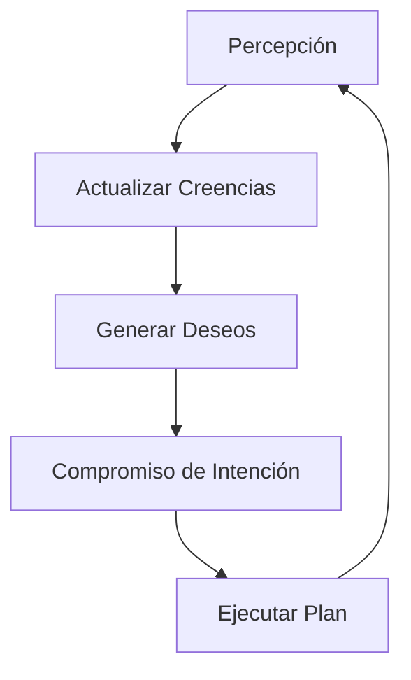

# 🏗️ Framework Integration for BDI (BDI-in-a-Box)

Conexión de la ontología formal con sistemas de agentes de software.

## 1. Conexión con Python (Frameworks de Agentes)

Para integrar con frameworks como CrewAI o AutoGen:
- Se utiliza el grafo de estados mentales como memoria episódica.
- Cada "step" del agente genera un log Turtle que se añade a un grafo de histórico.

## 2. Integración con Gemini CLI

El motor de Gemini Elite Core utiliza este framework de la siguiente manera:
- **Planning**: Generación de intenciones a partir de deseos de alto nivel.
- **Verification**: Validación del plan mediante consultas SPARQL antes de la ejecución.
- **Reporting**: Uso de resúmenes de estados mentales para explicar por qué se tomó una decisión.

## 3. Arquitectura de Razonamiento

## 4. Almacenamiento (GraphDB)

- Los estados mentales se almacenan en un `Triplestore` persistente si el agente opera a largo plazo.
- Se recomienda el uso de formatos ligeros como JSON-LD para intercambio entre microservicios.
