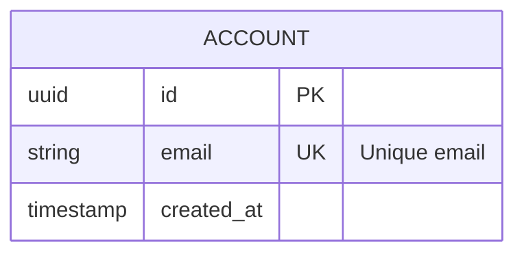

# ERD Best Practices (Crow's Foot Notation)

## Cardinality Cheat Sheet
- `||--||`: Exactly one to exactly one.
- `||--o{`: Exactly one to zero or many.
- `||--|{`: Exactly one to one or many.
- `o{--o{`: Zero or many to zero or many.

---

## Attribute Detail
Always include data types for clarity in architectural docs.

---

## Naming Conventions
- Use `UPPERCASE` for entities.
- Use `snake_case` for attributes.
- Use `lowercase` for relationship verbs.

---

## Grouping & Domains
For large databases, use comments to separate domains (e.g., `%% --- Auth Domain ---`).

---

## When to use ERD vs. Class Diagram
- **ERD**: For data persistence, database schemas, and storage-level relationships.
- **Class Diagram**: For runtime object relationships, inheritance, and interface implementation.
