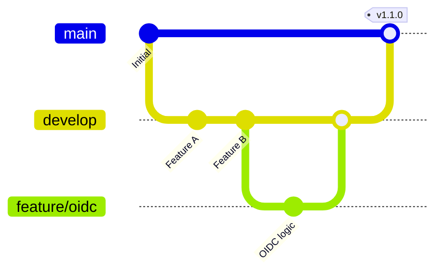

# Gitgraph for DevOps & Workflows

## Visualizing Release Cycles
Show how a feature moves from development to production.



---

## Explaining Hotfixes
Use Gitgraph to justify why a hotfix was necessary and how it was merged back to develop.

```mermaid
gitGraph
    commit id: "v1.0"
    branch hotfix/auth
    checkout hotfix/auth
    commit id: "Fix leak"
    checkout main
    merge hotfix/auth tag: "v1.0.1"
    checkout develop
    merge hotfix/auth
```

---

## Best Practices
1. **Commit Labels**: Use short, descriptive IDs or labels.
2. **Tags**: Always use tags for releases.
3. **Branch Colors**: Customize branch colors to differentiate between `main` (stable) and `feature` (ephemeral) branches.
