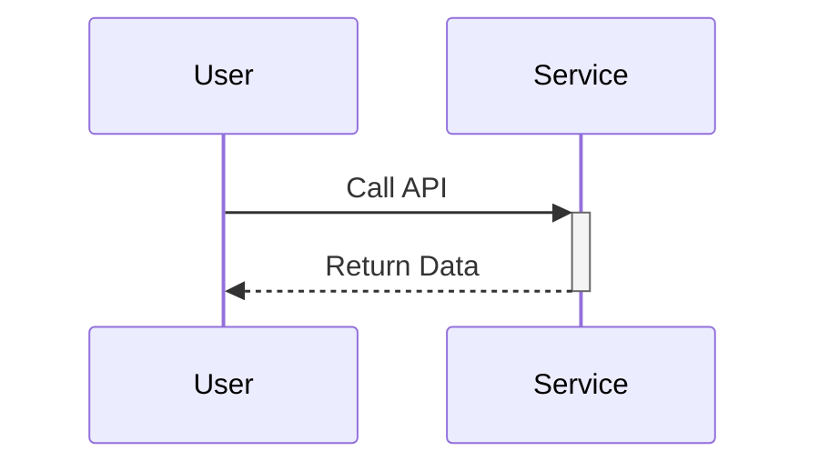
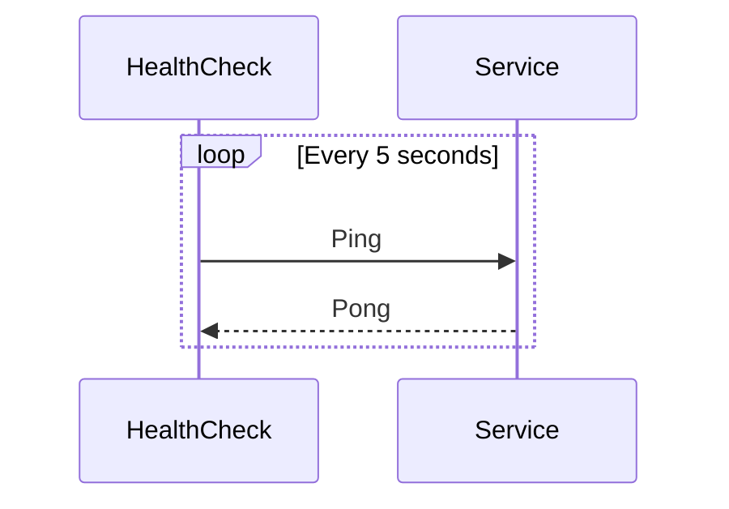
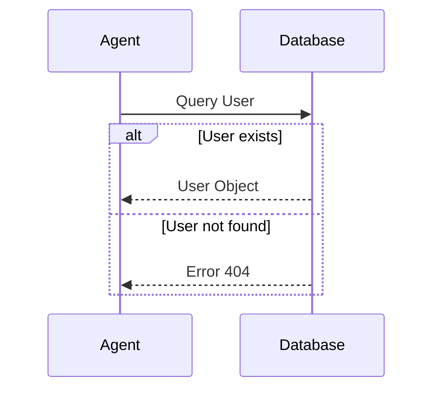
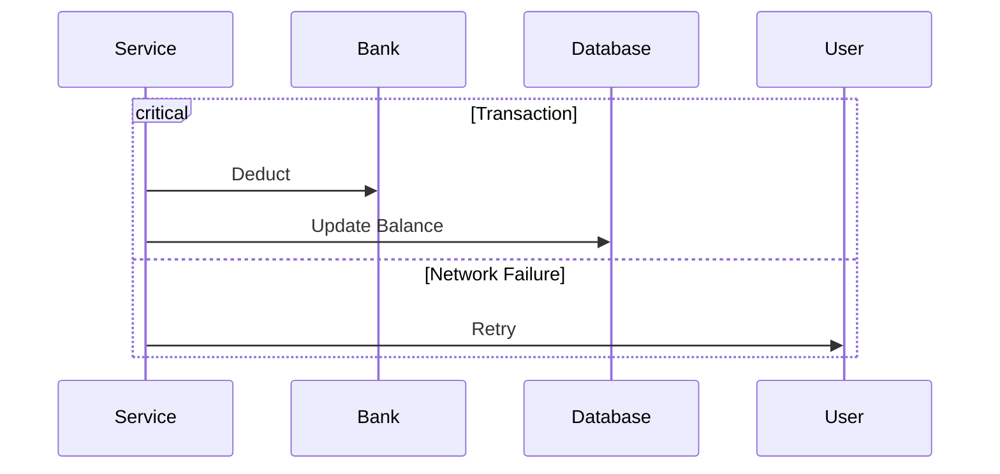

# Advanced Sequence Diagram Patterns

## 1. Activations & Lifelines
Clearly show when an object is "busy" using `activate` and `deactivate` (or the `+`/`-` shorthand).

---

## 2. Loops (Repetitive Actions)
Use `loop` for actions that repeat until a condition is met.

---

## 3. Alternatives (Conditional Logic)
Use `alt` and `else` to show branching paths.

---

## 4. Parallel Actions
Use `rect` (rectangle) or simply grouped messages to show parallel interactions, although Mermaid doesn't have a strict `par` tag, you can use `Parallel` notes.

---

## 5. Critical Sections
Use `critical` for operations that must succeed or fail as a unit.

