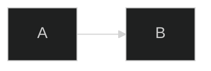
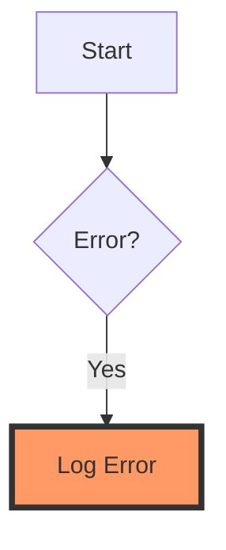
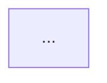

# Styling & Themes in Mermaid.js

## Built-in Themes
- `default`: Clean and light.
- `neutral`: Grayscale for print-friendly docs.
- `dark`: Optimized for dark-mode IDEs/docs.
- `forest`: Green-toned for organic flows.

---

## Direct Styling
Use `style` or `classDef` to highlight specific nodes.

---

## Configuring the Layout Engine (ELK)
For extremely complex graphs, the default Dagre engine can fail. Use ELK for better results.

---

## Global Configuration
In 2026, many documentation sites (e.g., VitePress, Docusaurus) allow global Mermaid configuration in their `config.js`.

### Key Configs:
- `fontSize`: Standardize text size.
- `fontFamily`: Use your project's brand font.
- `securityLevel`: Set to `loose` only if you need HTML in labels.
