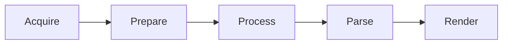

# 🏗️ LLM Pipeline Architecture Patterns

Referencia técnica de patrones de arquitectura para pipelines de agentes en Gemini Elite Core.

## 1. El Pipeline Canónico (The Canonical Pipeline)

Una arquitectura discreta, idempotente y por etapas.



## 2. Patrón: Stage-Based Persistence

Usa el sistema de archivos para persistir el estado entre etapas.

```text
data/
├── 01_raw/        # Datos crudos de la fuente.
├── 02_prepared/   # Datos formateados para el LLM.
├── 03_processed/  # Salidas crudas del modelo.
├── 04_parsed/     # Datos estructurados (JSON).
└── 05_final/      # Artefactos finales para el usuario.
```

## 3. Patrón: Architectural Reduction (Simplificación)

A medida que los modelos (ej. Gemini 3 Ultra) se vuelven más capaces, simplifica la arquitectura.

- **Antes**: Múltiples agentes y un supervisor para una sola tarea.
- **Ahora**: Un solo prompt bien estructurado ("Context Engineering") que logra lo mismo con menos latencia y coste.

## 4. Patrón: Estimación de Costes (Budgeting)

- **Input Cost**: $0.075 / 1M tokens (Gemini 3 Flash).
- **Output Cost**: $0.30 / 1M tokens (Gemini 3 Flash).
- **Scaling**: Para 1000 tareas complejas (ej. 100K tokens/tarea), el coste estimado es ~$10-15 USD.

## 5. Patrón: Manejo de Errores y Reintentos

- **Nivel 1 (Atómico)**: Reintentar la llamada al LLM con un prompt ligeramente diferente (Añadiendo "Be more concise", etc.).
- **Nivel 2 (Estructural)**: Volver a la etapa de 'Prepare' y cambiar la selección de datos.
- **Nivel 3 (Fallo)**: Marcar la tarea para revisión humana o ignorar si es tolerable.

## 📏 Métricas de Pipeline

| Métrica | Objetivo |
| :--- | :--- |
| **Stage Isolation** | 0 fugas de estado entre etapas. |
| **Idempotency** | Re-ejecutar una etapa no cambia el resultado final. |
| **Pipeline Latency** | Tiempo total desde 'Acquire' hasta 'Render'. |
| **Throughput** | Número de tareas completadas por hora. |
